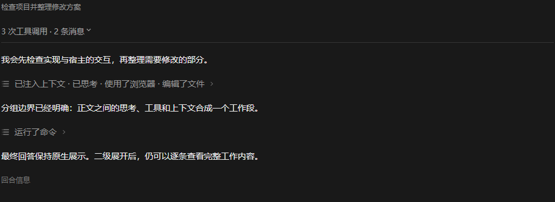

# dsh-auto-collapse

> A DeepSeek Harness Web client plugin that auto-collapses tool cards and Think blocks into one-line summaries, so the chat keeps only what the model says.
>
> 中文: [README.md](./README.md)
>
> This plugin is listed in the Plugin marketplace: [marketplace link](https://www.dsh.so/artifact/dsh-auto-collapse/)

## What it does

`dsh-auto-collapse` is a pure front-end DOM plugin for the DeepSeek Harness Web chat UI. It collapses the working process into one-line summaries — tool calls and reasoning no longer fill the screen, giving the chat the collapsible look of the VSCode Codex desktop client, **and it also rewrites the official status line (“深度求索中...”, formerly “Deep diving”) to a configurable “Deep sleeping...”**. It never modifies message content — it only controls visibility of the working process.

## Preview



## Features

- **Turn-level auto collapse** (Level 1): when a turn finishes, the whole working process collapses into a `已处理 X秒` (processed in Xs) row, leaving only the model's final text. Click to expand the full workflow (context injections → thinking → tool calls → intermediate text → final text). On DSH 0.1.2+, which ships a native per-turn summary row (tool-call · message · subagent counts), the Level 1 row yields to it and is no longer shown; second-level folding is unaffected.
- **Second-level rows**: after expanding level one, tool-call groups and think blocks each collapse into a single chip row (`正在运行 {command}` / `运行了命令` / `已思考`), click to expand/collapse; adjacent tool groups merge, while body text serves as a hard boundary (never merged across).
- **Third-level think merge**: expanding `已思考` shows consecutive think rows merged into one row titled `Think · first line`, click to reveal the merged content block; raw fourth-level rows never appear.
- **Native visual alignment**: 16px icon box / 14px glyph / 24px line height / 16px row gap; colors use DSH native tokens (`--dsw-alias-label-*`); think and command icons come from DSH native icons (`IconThinkOutline14` / `IconApiOutline14`).
- **Stream-friendly**: in-place `assistant-step` body updates, React node replacement, and out-of-order history mounting are reconciled on every pass; running rows use a smooth text pulse motion, disabled by `prefers-reduced-motion`.
- **Complete work-node coverage**: top-level `command` / `manual-compaction`, context nodes, and image-only finals follow the same turn semantics as tool calls.
- **Configurable status text**: in Settings → Plugins → Plugin configuration, edit the status prompt (default `Deep sleeping...`); leaving it blank restores the official copy (“深度求索中...” in current builds). The host-appended elapsed suffix (e.g. `33秒`) is preserved.
- **Fully reversible**: uninstalling (HMR stop) restores every collapsed/hidden/rewritten node.

## Compatibility

| Plugin version | DSH compatibility |
|---|---|
| 0.1.7 | **DSH 0.1.2-rc.1+** (new settings API, native turn-process rows, Chinese status copy) |
| ≤ 0.1.6 | DSH 0.1.1.x |

Since 0.1.7 the plugin no longer depends on the removed `@deepseek-ai/dsh-settings` exports (the host half wires an optional consumer), but client service injection relies on 0.1.2's `dsh-client-modules` and has not been verified on 0.1.1. DSH 0.1.1 users should stay on 0.1.6.

## Install


Published npm package (recommended; uses the prebuilt release):

```bash
dsh plugin --profile web add "dsh-auto-collapse"
```

Install from GitHub when using the development version or following `main`:

```bash
dsh plugin --profile web add "github:a179-sanae/dsh-auto-collapse#main"
```

Restart the DSH web service (or trigger plugin HMR), then hard-refresh the page (`Ctrl+Shift+R`). No configuration needed.

## Development

### Project layout

```
src/fold.ts       core: FoldController (state machine) + findBlocks (block recognition) + collapse/expand logic
src/client.ts     browser entry (plugin registration)
src/index.ts      host half (host-side entry)
build.mjs         build script (generates lib/client.js, lib/index.js, and lib/types/*)
tsconfig.build.json TypeScript declaration build configuration
deploy.mjs        safe deploy: validate → back up → replace → verified restart → hash check/rollback; Windows uses PowerShell, Linux/macOS use lsof + ps
cordis.patch.yml  profile tree mounting
test/             fake-DOM contract, race, session-switch, and 40-order permutation regressions
```

### Checks

```bash
npm run check
```

Runs TypeScript checking, a fresh build, and the complete regression suite.

### Quick deploy (local dev)

```bash
npm run deploy
```

Validates the plugin/DSH package identities and the process listening on port 3080, then creates a timestamped backup, replaces the bundle, restarts DSH, and verifies the served hash. Failures restore the old bundle. Windows, Linux, and macOS are supported; Unix systems locate DSH from `npm root -g` by default and use `HOME` for the profile path. Linux/macOS require `lsof`. Override defaults with `DSH_AUTO_COLLAPSE_LIB`, `DSH_DIR`, `DSH_WEB_PORT`, and `DSH_LOG_DIR`.

### Publishing a new version

Update the `version` in `package.json`, then publish to npm (the `prepack` hook builds automatically):

```bash
npm publish --access public
```

For local development, you can pack a tgz without publishing:

```bash
npm pack --pack-destination <local-plugin-dir>
```

Point the plugin dependency in the profile's `package.json` to the new tarball and reinstall the plugin.

### Key mechanisms

- **Block recognition** (`findBlocks`): top-level nodes are classified as tool calls, command/manual-compaction cards, contexts, thinking, or body content; user/steering/turn-tail nodes are hard boundaries.
- **Segment reconciliation**: every pass rebuilds segments from current DOM order. The last `assistant-step` containing text or media is final; earlier bodies are intermediate work. Stable flow/node keys preserve UI state without one-shot mutation bookkeeping.
- **Duration**: streaming segments each track their own first running observation; historical segments parse official duration or the `timeStart`/turn-tail range. Whole minutes omit the seconds field.
- **React coexistence and reversibility**: replaced nodes rebind by stable key, removed level-one rows rebuild with their expansion state, and every inline `display` value is saved before mutation and restored exactly.

## License

MIT
